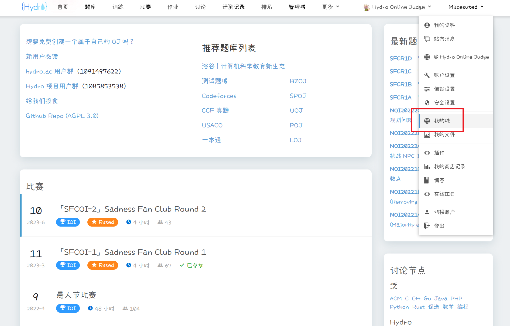
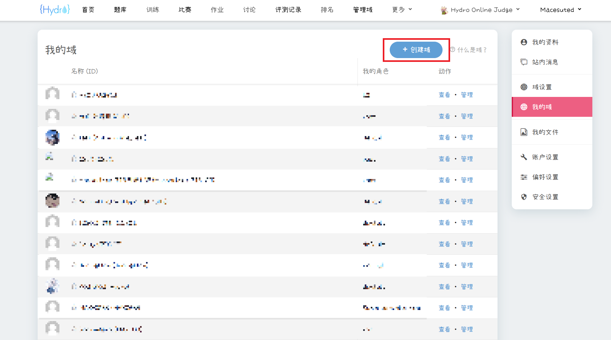
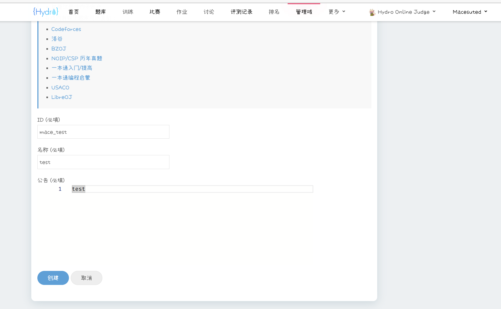

# 创建与管理

## 实例选择

可以在任何一个 Hydro 实例上创建域，除非实例管理员禁止用户创建。

我们建议你在主站 [HydroOJ](https://hydro.ac/) 上创建属于你自己的域，有以下几点原因：

1. 主站软硬件均由 Hydro 开发组维护，系统稳定性高，出现故障时将会第一时间修复，主站发现的 BUG 也将被优先修复。
2. 日常评测算力达 48 CPU 核心，可提供高效稳定的评测服务和在线 IDE 自测服务。
3. 可向域中添加 [Luogu](https://hydro.ac/d/luogu/)、[Codeforces](https://hydro.ac/d/codeforces/)、[SPOJ](https://hydro.ac/d/spoj/)、[UOJ](https://hydro.ac/d/uoj/)、[POJ](https://hydro.ac/d/poj/) 的全部题目（使用 RemoteJudge），[LibreOJ](https://hydro.ac/d/loj/)、[一本通题库](https://hydro.ac/d/ybttk/) 的全部题目（使用本地评测），和官方维护的 [BZOJ](https://hydro.ac/d/bzoj/)、[CCF 真题](https://hydro.ac/d/ccf/)、[USACO](https://hydro.ac/d/USACO/) 等题库的题目（尚未完全上传）。
4. （**收费功能**）支持为自己的域绑定自定义域名，更换网页 Logo，更改网页名称，更改首页元素布局等功能。

## 创建域

将鼠标悬停在右上角用户名上，在展开的下拉栏中点击“我的域”。

点击“创建域”。

在页面内写入：

1. ID：用于区分不同的域，创建后无法更改。与 URL 相关，若 ID 为 `abc`，则域主页网址将为 `https://hydro.ac/d/abc/`，题库页面网址为 `https://hydro.ac/d/abc/p/`，以此类推。
2. 名称：域的显示名，创建后可更改。
3. 公告：在域主页上现实的内容。

点击“创建”，会创建域并跳转到它的管理页面。

